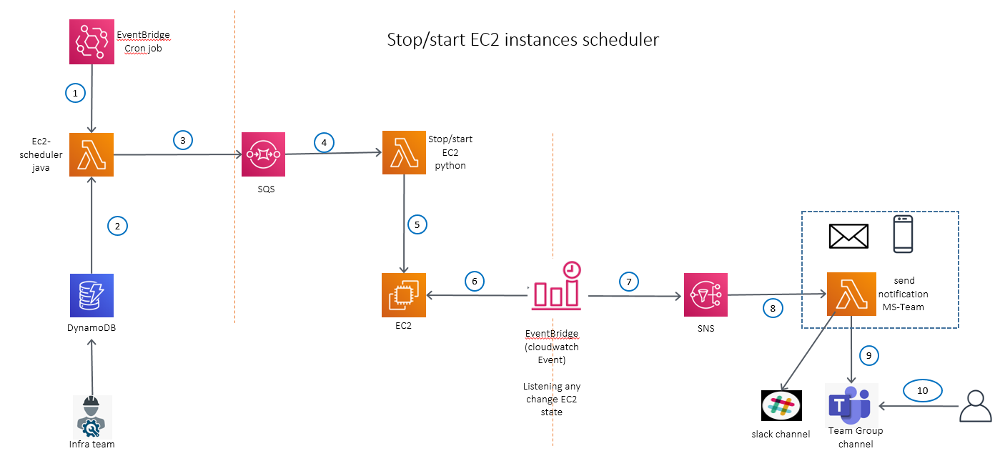

# Introduction

This is an CDK program written in Java to manage the EC2 instances scheduler with other AWS services. 



# Technologies

- Lambda function (java + python)
- SQS
- EventBridge
- DynamoDb
- CloudWatch Event
- EC2 instance
- CDK Tool Kit
- X-Ray

# Micro-services as lambda function
1 - instance-schedule java
2 - stop-start-instance python
3 - ec2-change-state python

## set aws cli as local environment

set up ~/.aws/credentails

````
[dev]
aws_access_key_id = xxxxxxx
aws_secret_access_key = xxxxxxxxxxxx/5V+o7CXv283Ep
[sit]
aws_access_key_id = xxxxxxx
aws_secret_access_key = xxxxxxxxx

[uat]
#[default_uat]
aws_access_key_id = xxxxxxxxx
aws_secret_access_key = xxxxxxxxxxxxxxx
````

# deployment
1 - ./build-with-layer.sh  ( populate java libraries as lib layer)

2 - deploy.sh dev|sit|uat (deploy cdk into AWS server)

## Deploy/Destroy

- `cdk deploy --all -c ENV=[name]`. The environment name must match the key for your environment in the `cdk/src/main/resources/env.json` file. 
- `cdk destroy --all -f -c ENV=[name]`.


## Building

To build this app, run `mvn compile`. This will download the required
dependencies to compile the Java code and create jar

You can use your IDE to write code and unit tests, but you will need to use the
CDK toolkit if you wish to synthesize/deploy stacks.

If you need to modify the lambda code then do mvn package and copy the
jar file to asset directory in the parent module
## CDK Toolkit

The [`cdk.json`](./cdk.json) file in the root of this repository includes
instructions for the CDK toolkit on how to execute this program.

Specifically, it will tell the toolkit to use the `mvn exec:java` command as the
entry point of your application. After changing your Java code, you will be able
to run the CDK toolkit commands as usual (Maven will recompile as needed):
    $ cd cdk
    $ cdk ls
    <list all stacks in this program>

    $ cdk synth
    <cloudformation template>

    $ cdk deploy
    <deploy stack to your account>

    $ cdk diff
    <diff against deployed stack>


## populate sit dynamo db
````
[
  {
    "id":"uuid",
	"name": "server ec2 stop/start",
    "days": [
      "mon",
      "tue",
      "wed",
      "thu",
      "fri"
    ],
	"starTime": "08:00",
    "stopTime": "18:00",
    "instanceIds": [
      "i-04axxxccc",
      "i-079e4xxacc",
      "i-0aa4xe6"
    ]
  },
  {
    "id":"uuid",
	"name": "server ec2 stop all day",
    "allDays": true,
    "stopTime": "22:00",
    "instanceIds": [
      "i-07fa58axxxxx1046",
      "i-0f4fedxxxx285d044"
    ]
  }
]

````
## CloudWatch Even
````

    {
//            "source": ["aws.ec2"],
//            "detail-type": ["EC2 Instance State-change Notification"],
//            "detail": {
//            "state": ["stopped", "running", "shutting-down", "terminated"]
//        }


//        {"account":"$.account","instance-id":"$.detail.instance-id","region":"$.region","state":"$.detail.state","time":"$.time"}
        {"instance-id":"<instance-id>","state":"<state>","time":"<time>","region":"<region>","account":"<account>",
            "message": "At <time>, the status of your EC2 instance <instance-id> on account <account> in the AWS Region <region> has changed to <state>."
        }

````

##MS team
````
HookUrl	https://company.webhook.office.com/webhookb2/64xxxxxxxxx39e3e1a@36fae7a7-647f-49c3-8de3-e0e14ea818ed/IncomingWebhook/2cxxxx7b83c/0e3de6ea-9abb-4f7a-95cd-3ec6b796d2ca

````